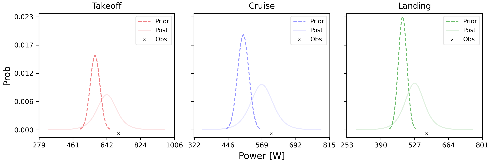
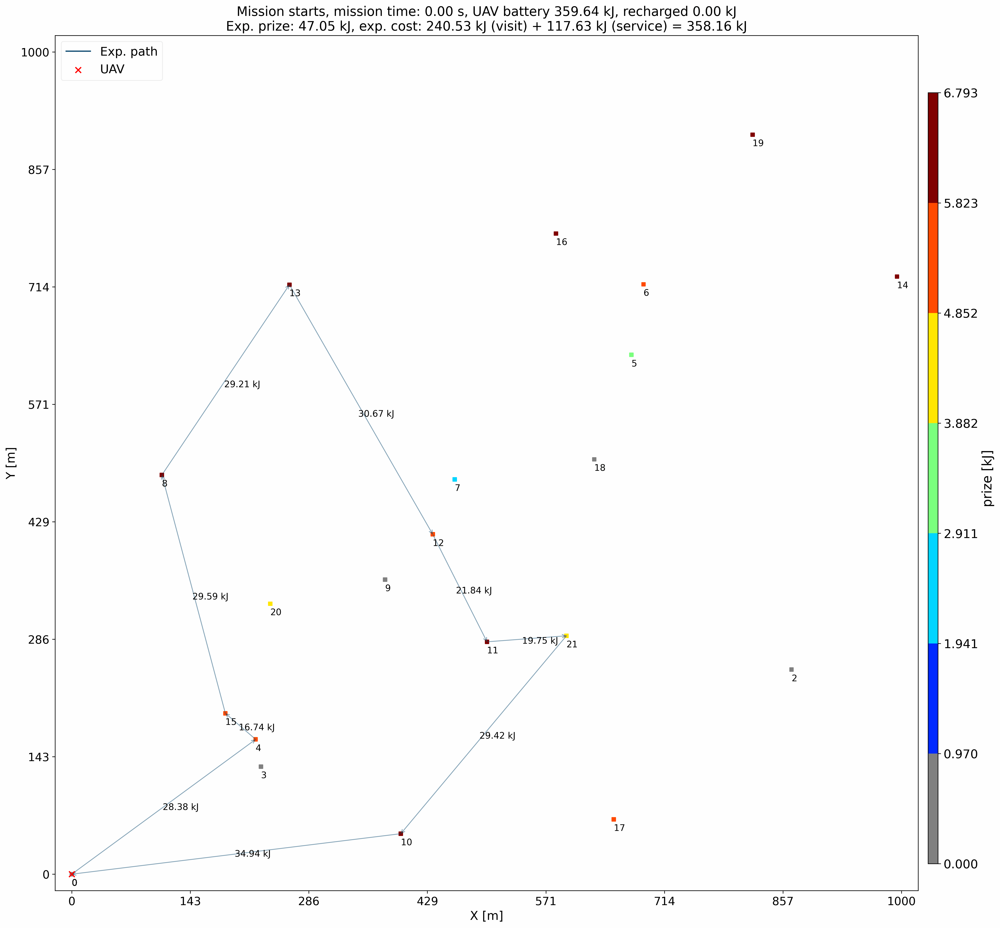

# Uncertain-Dynamic-OP

The Uncertain and Dynamic Orienteering Problem (UDOP) considers real-world edge costs (i.e., dynamic, stochastic, and initially unknown) and their potential impacts on prizes and prize-collection costs. To address UDOP, we develop ADaptive Approach for Probabilistic paThs (ADAPT) is a framework that combines offline planning, execution and online planning. ADAPT dynamically adjusts its estimation for edge costs and performs online re-planning in uncertain environments. More details please check our [paper]():
```

```

## Dataset
We randomly deploy nodes in a 1 km x 1 km area with 20, 30, 40 nodes. The dataset has the following format:

| latitude | longitude | altitude | voltage |
|----------|-----------|----------|---------|

Note that we converted latitude, longtitude and altitude to 3D Eulidean coordinate respect to the original base. So `lat`, `lon`, and `alt` of all dataset in `instances/` are actually x,y,z coordinates. 

## Results
All results are in `results/`.

## Visualization
### Bayesian inference for updating posterior distributions


### ADAPT process for solving Charging Scheduling Problem
