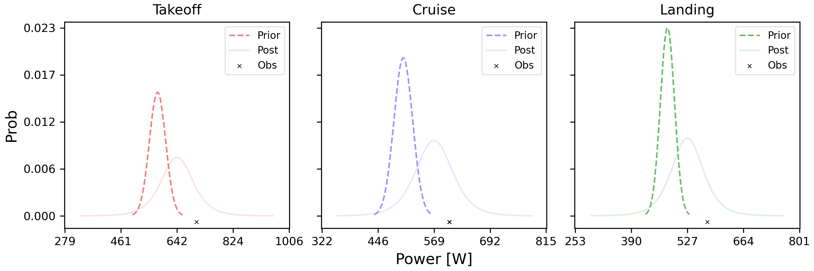
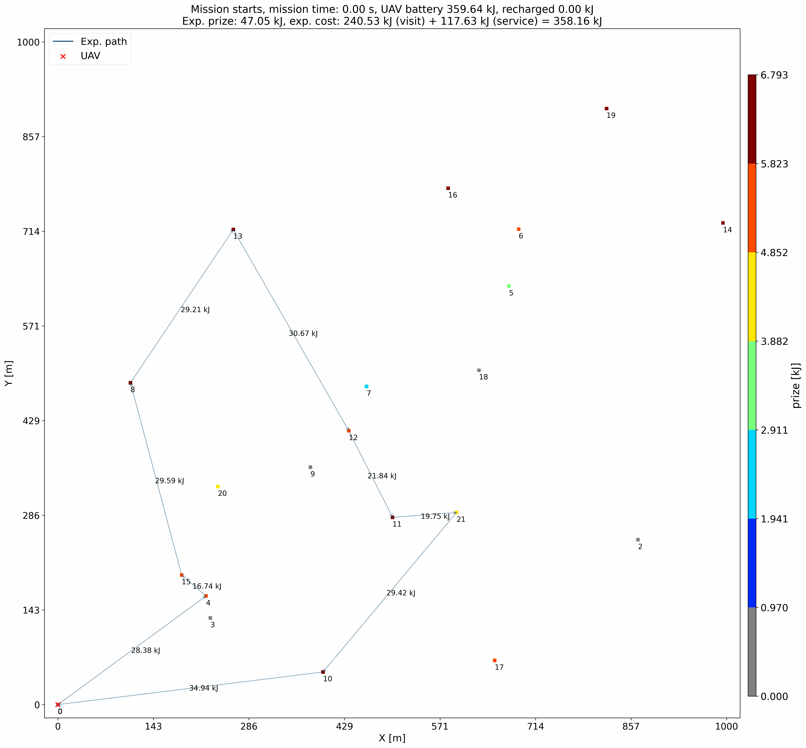

# Uncertain-Dynamic-OP

The Uncertain and Dynamic Orienteering Problem (UDOP) considers real-world edge costs (i.e., dynamic, stochastic, and initially unknown) and their potential impacts on prizes and prize-collection costs. To address UDOP, we develop ADaptive Approach for Probabilistic paThs (ADAPT) is a framework that combines offline planning, execution and online planning. ADAPT dynamically adjusts its estimation for edge costs and performs online re-planning in uncertain environments. More details please check our [paper](https://ieeexplore-ieee-org.iclibezp1.cc.ic.ac.uk/abstract/document/10824836):
```
@ARTICLE{10824836,
  author={Qian, Qiuchen and Wang, Yanran and Boyle, David},
  journal={IEEE Internet of Things Journal}, 
  title={Adaptive Probabilistic Planning for the Uncertain and Dynamic Orienteering Problem}, 
  year={2025},
  volume={},
  number={},
  pages={1-1},
  keywords={Costs;Autonomous aerial vehicles;Planning;Vehicle dynamics;Adaptation models;Uncertainty;Stochastic processes;Safety;Power demand;Dynamic scheduling;Orienteering Problem with uncertainties;UAV;Charging Scheduling Problems;Bayesian Inference},
  doi={10.1109/JIOT.2025.3525985}}
```

We demonstrate the effectiveness of ADAPT on the Charging Scheduling Problem (CSP) for UAVs. CSP is a variant of UDOP where the UAV needs to visit a wireless sensor network (WSN) to recharge sensor nodes' supercapacitor banks. ADAPT includes 3 submodules for solving the CSP: 
* **offline-planning**: it generates an offline (initial) plan `exp_chrg_list.csv` and edge cost estimation `offline_edge_costs.csv` based on UAV's initial status and given instances.
* **simulation**: it simulates the process (UNKNOWN to the UAV) of UAV visiting (include the end node) and servicing the nodes, and the energy change of the entire WSN. The recorded power log `avg_power_log.csv`, mission execution log `mission_log.csv` and instance (i.e., WSN) file will be updated after execution of **simulation**. 
* **online planning**: it generates an online plan based on the updated WSN file, the recorded power log `avg_power_log.csv`, and mission execution log `mission_log.csv`.

## Prerequisites
* ISO C++20 standard
* [boost >= 1.78.0](https://www.boost.org/users/history/version_1_82_0.html) used in online-planning. For MS VS IDE, an example configuration is as follows: 
  * `Configuration Properties` -> `C/C++` -> `General` -> `Additional Include Directories`, add `C:\Program Files\boost\boost_1_82_0`
  * `Configuration Properties` -> `C/C++` -> `Precompiled Header` -> `Not Using Precompiled Headers`
  * `Linker` -> `General` -> `Additional Library Directories` ->  `C:\Program Files\boost\boost_1_82_0\libs`

## Usage
After a successful build with the correct names and executable files for all three submodules (see those `.exe` files in `main.sh`), users may run the following commands at the root directory of the project:
```
$ chmod +x main.sh
$ ./main.sh
```
The `main.sh` script will run the offline-planning, simulation, and online-planning submodules sequentially. The results will be stored in the `results/` directory. The script has been tested on Ubuntu 18.04.3 LTS.

## Dataset
We randomly deploy nodes in a 1 km x 1 km area with 20, 30, 40 nodes. The dataset has the following format:

| latitude | longitude | altitude | voltage |
|----------|-----------|----------|---------|

Note that we converted latitude, longtitude and altitude to 3D Eulidean coordinate respect to the original base. So `lat`, `lon`, and `alt` of all dataset in `instances/` are actually x,y,z coordinates. 

## Results
All results are in `results/`.

## Visualization
### Bayesian inference for updating posterior distributions


### ADAPT process for solving Charging Scheduling Problem

